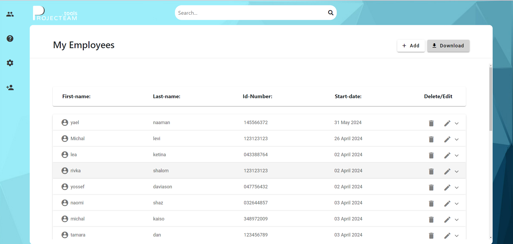
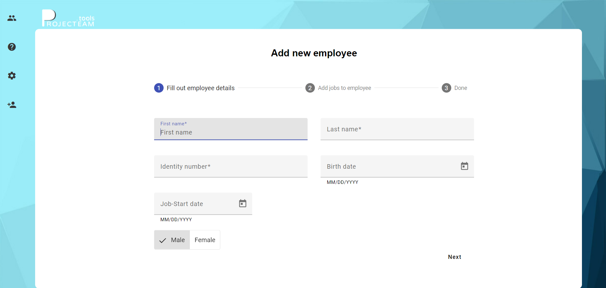

# Employees Management System

This project is designed for managing the list of employees in a business in an organized and convenient way. The project is developed as part of C# and Angular learning, using advanced technologies and libraries to create an efficient and user-friendly interface.

## Technologies Used:

### Backend API - C# .NET 8
- The API is developed consistently with the layers model.
- It connects to a SQL database using CODE-FIRST methodology.
- It utilizes the ENTITY-FRAMEWORK library for managing and accessing the database.

### Client Side - Angular 17
- Developed using Angular 17.
- Makes extensive use of advanced Angular features.
- Uses design libraries such as ANGULAR-MATERIAL and BOOTSTRAP.

## Key Features:
- Displaying the list of employees in a well-organized table.
- Options for deleting, adding a new employee, and editing existing employee details.

To run the project locally, follow these steps:

### Backend
1. Open the C# project in your development environment (e.g., Visual Studio).
2. Run the API server.

### Frontend
1. Open a terminal and navigate to the Frontend directory of the project.
2. Run the command `npm install` to install all dependencies.
3. Run the command `ng serve` to start the local Angular server.

After completing these steps, the project will be available for use at `http://localhost:4200/`.

## Installation of the Database:

### Creating a New Migration
1. Open the Package Manager Console in Visual Studio.
2. Run the command `Add-Migration InitialCreate` to create a new migration.
3. Run the command `Update-Database` to apply the migration and update the database.

